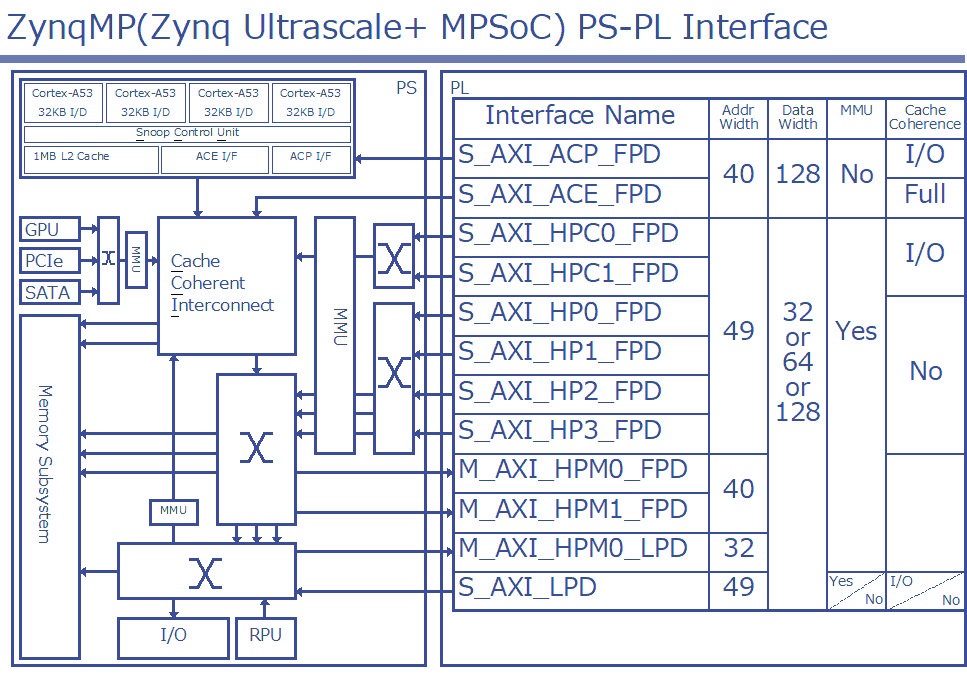

ZynqMP ACP Adapter
==================

## Overview 

### Introduction

The PL masters can also snoop APU caches through the APU’s accelerator coherency port(ACP).
The ACP accesses can be used to (read or write) allocate into L2 cache. However, the ACP only supports aligned 64-byte and 16-byte accesses. All other accesses get a SLVERR response.

## Features

ZynqMP-ACP-Adapter is an adapter to connect AXI Master to ZynqMP Accelerator Coherency Port(ACP).
The adapter then splits any burst-length transaction into several 64-byte or 16-byte transactions.

ZynqMP-ACP-Adapter is written in synthesizable VHDL.

## Licensing

Distributed under the BSD 2-Clause License.

